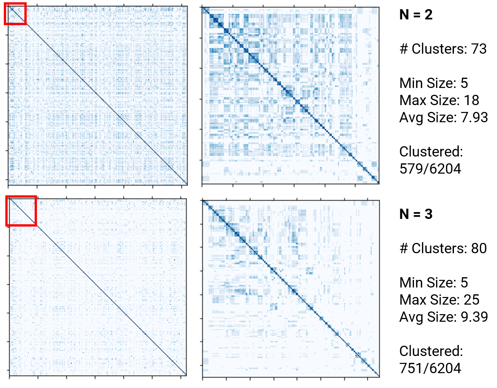
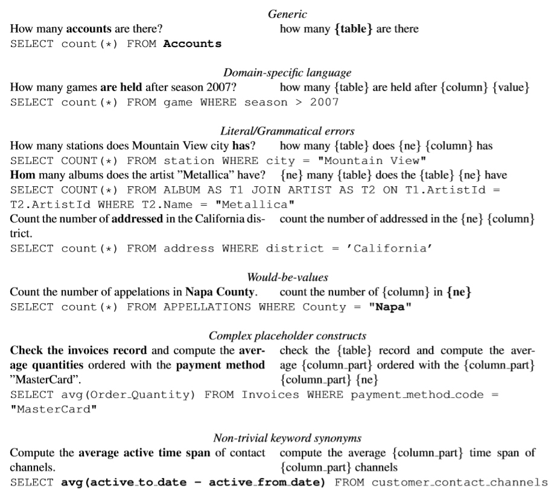

# NLIDB Generalization - What can we *learn* from Spider?

This repository contains code and data for the paper "An Analysis of the Linguistic Variability of the Spider Dataset and its Implications for Automatic Training Data Generation" (currently under submission).

In the paper, we present a generalization pipeline for NL queries that we use to analyze the linguistic variety of samples in the [Spider dataset](https://yale-lily.github.io/spider).
This analysis consists both of automatic approaches (like clustering) and manual inspection of the entries.
For the latter, we manually annotated the samples from the spider training set with aspects that might prevent the automatic generation of that NL-SQL-pair.
That annotated dataset might be used to better evaluate which aspects of generalization a NLIDB approach already supports.
Based on these analysis steps, we identify challenges that need to be overcome to generate NL2SQL training data through weak supervision that can cover the variety of real-life user input to NLIDBs.

You can find the source code for the experiments, especially the data generalization pipeline, and the annotated Spider training dataset in this repository.

We hope that this analysis together with the annotated dataset will be helpful for development and evaluation of NLIDBs in the future.

## Linguistic Variety Analysis Pipeline

Our experiments to estimate the level of linguistic variety used in the Spider dataset can be found in the `analysis` folder.

We publish two variants of the analysis pipeline, one working on token level (`sentence_syntax_pattern_detection.ipynb`) and one working beyong word boundaries (`sentence_syntax_pattern_detection_beyond_words.ipynb`).

Additionally, you can find Notebooks and Python Scripts to cluster using S-BERT (`cluster_questions_with_sbert.py`) or using the generalized surface forms (`cluster.ipynb`), as well as helpers add the additional annotations to the original Spider training files (`create.ipynb`) and compute some statistics (`stats.py`).

*Results from clustering, the resulting generalized forms still contain a large variety.*

## Meta-Annotations

Through inspection and manual annotation of the generalized forms produced by our pipeline, we identified several root causes for the complexity needed in training data generation for NLIDBs which we report in the paper.

To evaluate progress on the root causes described above, we provide manual annotations to the Spider training set.
We distinguish between the following challenge classes: (0) generic, (1) domain-specific language, (2) literal/grammatical errors, (3) would-be values, (4) complex placeholder constructs, (5) non-trivial keyword synonyms.

*Examples for the different annotation classes*

You can find the Spider dev dataset with the generalized queries in the `data` folder (both using original and lemmatized forms). The full annotated dataset will follow soon (paper still under submission).
